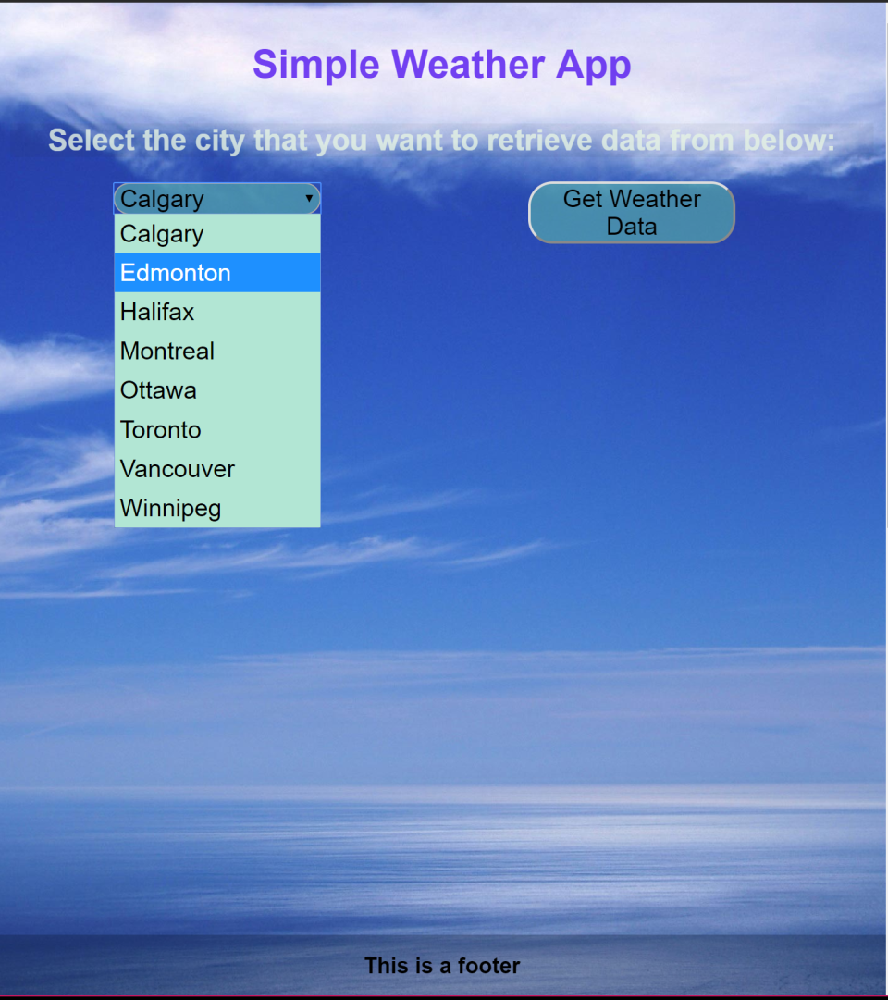
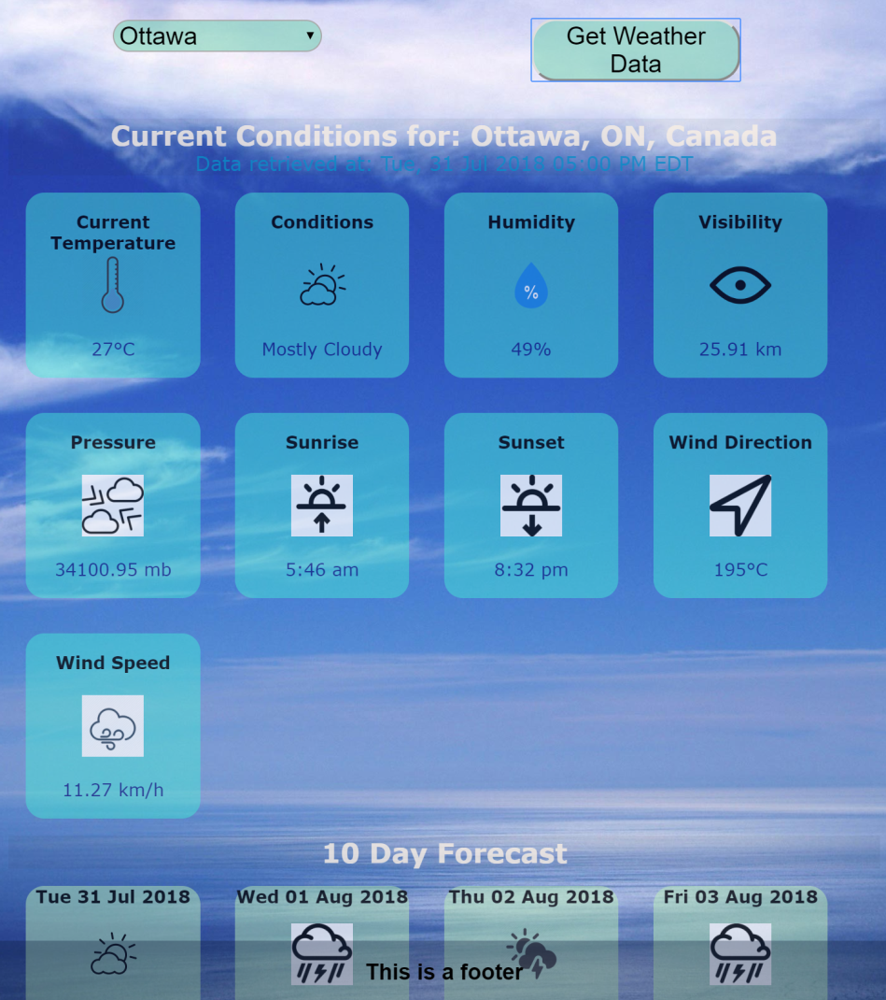
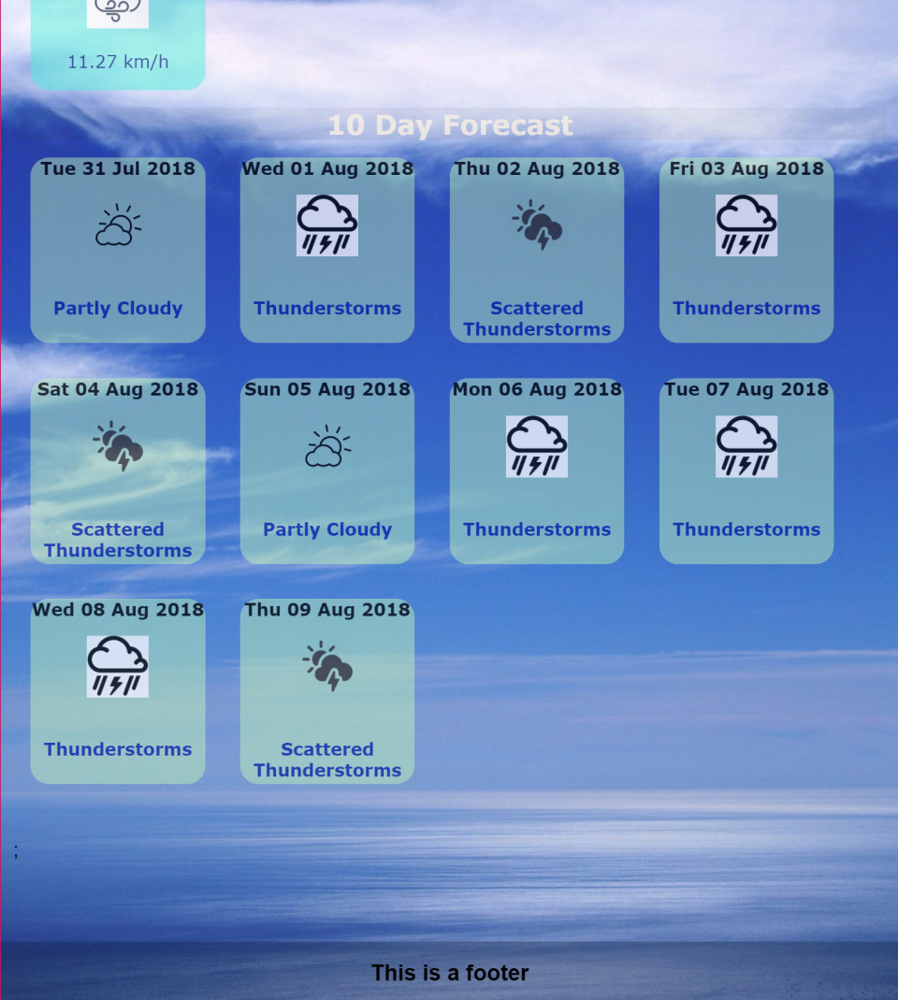

# ActAgain
Babby's first react project

## Images

 

 

 

## Notes / Usage
To start:
`runserver.sh`
Then go to localhost:8081

Reference:
- Yahoo Weather API: https://developer.yahoo.com/weather/archive.html#image
- Uses the Yahoo Weather API, which seems to be buggy at times.
For instance, the visibility and pressure values seem to be odd.
- images are mostly stock photos from online

## TODOs
- documentation (from checkout)